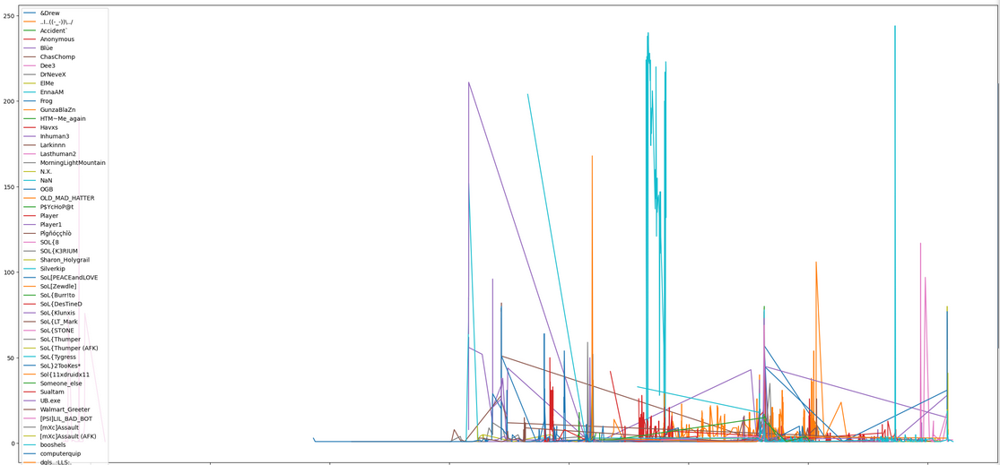

# NetMonitor

Is your UT2004 hosting provider arguing their network is the greatest network on the planet?  Are they asking you to run mtr to guage packet loss, even though icmp is throttled? 

Mutator for UT2004 servers to capture player ping and packetloss variations directly from the application, bypassing icmp entirely. This outputs .csv files which can be used in e.g. Jupyter to inspect any issues.  


### Options

```
bEnabled - Enable/disable the monitor
Interval - How often to query ping and packet loss info
LogTemplate - Format of the output filename
```

The default value for LogTemplate is `NMLog_%Map_%Mon_%D_%H_%Min`

Template options

```
%Map - map name
%S - second
%Min - minute
%H - hour
%D - day
%Mon - month
%Y - year
```


### Example output

